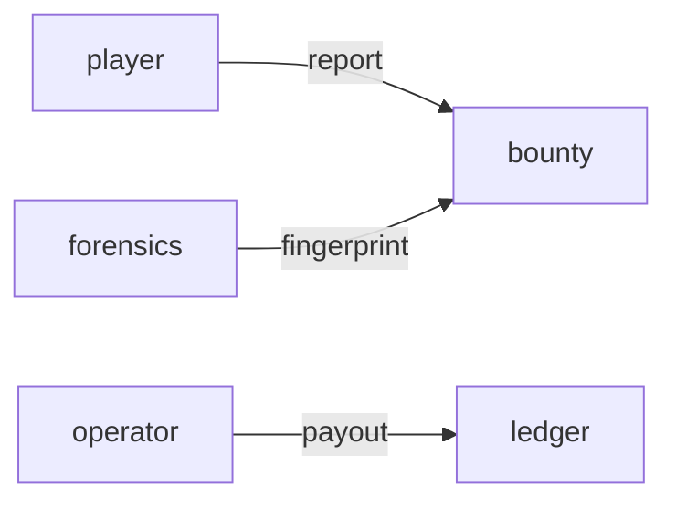

# Bounty

**Turn pet bug reports into actionable fixes.**

A planned report board for the desktop, overlay, and web apps, with severity triage and privacy-aware log handling.

**Stage: design scaffold.** This checkout contains a design document and a source placeholder. The experience below is planned; there is no runnable app or integrated service yet.

[Status](#status) · [Planned experience](#planned-experience) · [Contributor quickstart](#contributor-quickstart) · [Service contract](docs/CONTRACT.md) · [Ecosystem map](https://github.com/RicheyWorks/computerpets-ecosystem)

## Status

| Available today | What you can inspect |
| --- | --- |
| [Service contract](docs/CONTRACT.md) | Intended behavior, boundaries, and planned dependencies. |
| [Source placeholder](src/bounty/index.ts) | Name metadata only; no package.json, app, or runtime is checked in. |
| [MIT license](LICENSE) | Licensing terms for the repository. |

Gameplay, endpoints, integration arrows, and failure handling on this page describe implementation targets. No build/test harness, CI workflow, or product screenshots are included in this scaffold.

## Planned experience

- GET /v1/bounties — open, severity, reward
- POST /v1/reports — player filing (redact paths)
- POST /v1/payout — operator, Ledger ref

### Planned technology

TypeScript · React 19 · GitHub Issues mirror · severity SLA · optional Ledger payouts

### Planned connections

These arrows show intended dependencies, rather than working integrations.



## Contributor quickstart

With access to this private repository, Git and PowerShell are enough to review the scaffold:

```powershell
git clone https://github.com/RicheyWorks/computerpets-bounty.git
Set-Location computerpets-bounty
Get-Content docs/CONTRACT.md
Get-Content src/bounty/index.ts
```

Read [Service contract](docs/CONTRACT.md) before choosing implementation details. The commands above inspect the checked-in files; app installation, editor launch, and server startup become possible after a buildable project and entry point are added.

### First implementation target

**Public board + report form with path redaction + severity.**

You know it works when: Duplicate hash attaches. Exploit PoC stays private until patched.

Treat this as an acceptance target for a future implementation. Start with the documented slice, add the required project setup and focused tests, and update these instructions with commands that work from a fresh clone.

## Design boundaries

- Stay canon with 210 species. No illegal hybrids. No swapped voices.
- Treat the desktop overlay as the main quest. This organ is optional until wired.
- Fail soft: the overlay keeps walking if this service is down, unless this *is* the overlay.
- No PII in public artifacts (Steam id, wallet, home path, webcam frames).

**Required failure behavior:**

PII in a log → strip before public. Duplicate hash → attach to existing. No public exploit PoC until patched.

## Ecosystem

- [computerpets-forensics](https://github.com/RicheyWorks/computerpets-forensics)
- [computerpets-console](https://github.com/RicheyWorks/computerpets-console)
- [computerpets-sdk](https://github.com/RicheyWorks/computerpets-sdk)
- [computerpets-ledger](https://github.com/RicheyWorks/computerpets-ledger)
- [computerpets](https://github.com/RicheyWorks/computerpets) (issues)

Start with the [ComputerPets flagship](https://github.com/RicheyWorks/computerpets) for the desktop pet. This repository describes an optional extension; the [ecosystem map](https://github.com/RicheyWorks/computerpets-ecosystem) explains the broader plan.

## License

MIT. See [LICENSE](LICENSE).
