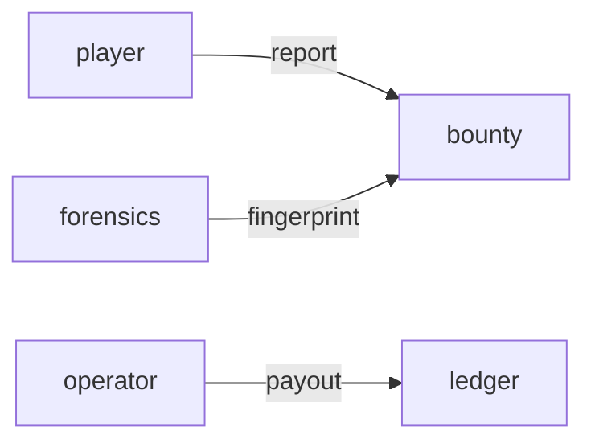

# Bounty

**Bug Bounty Board** — Public-facing issue tracker for the desktop client, overlay, and web apps.

Part of [ComputerPets](https://github.com/RicheyWorks/computerpets). Map: [computerpets-ecosystem](https://github.com/RicheyWorks/computerpets-ecosystem).

| | |
| --- | --- |
| Status | Design scaffold — contract frozen, implementation next |
| License | MIT |
| First pet | Still [Rui on the desktop](https://github.com/RicheyWorks/computerpets/blob/main/docs/START-HERE.md). This organ is optional. |

## The job

Crash logs from Forensics land here. Players file. Operators triage. Payouts (if any) go through Ledger, not a spreadsheet.

The flagship overlay already puts a living sticker on the real desktop (Rui first, 210 kinds). Bounty does not replace that. It is one organ.

## Who uses it

Players filing bugs, operators paying, Forensics dropping fingerprints.

## What it is not

Not a public exploit dump. PII stripped. No payout spreadsheet.

## Architecture



## Stack

TypeScript · React 19 · GitHub Issues mirror · severity SLA · optional Ledger payouts

GroupId / namespace: `com.enterprisepet.bounty`  
Default listen: `8080`

## Contract

### Data

`Bounty(id, severity, rewardAsset) · Report(id, redact, logsCid) · Payout(ref)`

### Surface

- GET /v1/bounties — open, severity, reward
- POST /v1/reports — player filing (redact paths)
- POST /v1/payout — operator, Ledger ref

### Failure doctrine

PII in a log → strip before public. Duplicate hash → attach to existing. No public exploit PoC until patched.

## First slice

Build this and stop. Do not boil the ocean.

**Public board + report form with path redaction + severity.**

You know it works when: Duplicate hash attaches. Exploit PoC stays private until patched.

## Environment

`GITHUB_TOKEN` (mirror), `LEDGER_URL`

Never commit secrets. Never put Steam or chain keys in the overlay.

## Neighbors

- computerpets-forensics
- computerpets-console
- computerpets-sdk
- computerpets-ledger
- computerpets (issues)

## Layout

```
computerpets-bounty/
  README.md           this file
  LICENSE             MIT
  docs/CONTRACT.md    the same contract, frozen for implementers
  src/                implementation lands here
```

## Run (Windows)

PowerShell, from this folder, after the flagship helpers (Git, Node LTS 22+, JDK 21 as needed):

```powershell
cd app; npm install; npm run dev
```

You do not need this service to meet Rui. The [flagship start-here](https://github.com/RicheyWorks/computerpets/blob/main/docs/START-HERE.md) is still the first pet.

## Links

- Flagship: [RicheyWorks/computerpets](https://github.com/RicheyWorks/computerpets)
- This repo: [RicheyWorks/computerpets-bounty](https://github.com/RicheyWorks/computerpets-bounty)
- Map: [RicheyWorks/computerpets-ecosystem](https://github.com/RicheyWorks/computerpets-ecosystem)
- Contract file: [docs/CONTRACT.md](docs/CONTRACT.md)

## License

MIT. See [LICENSE](LICENSE).

---

*Two hundred ten living kinds. Keep them so a line does not go quiet.*
